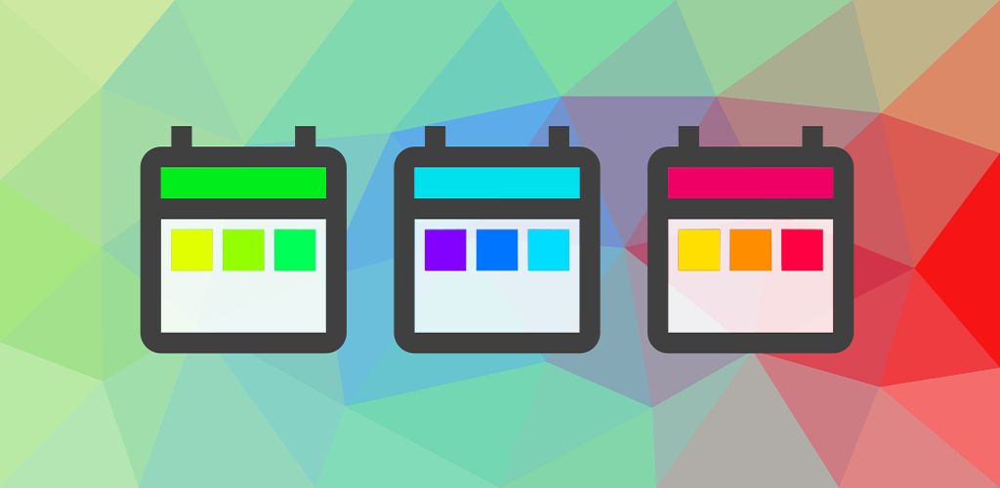
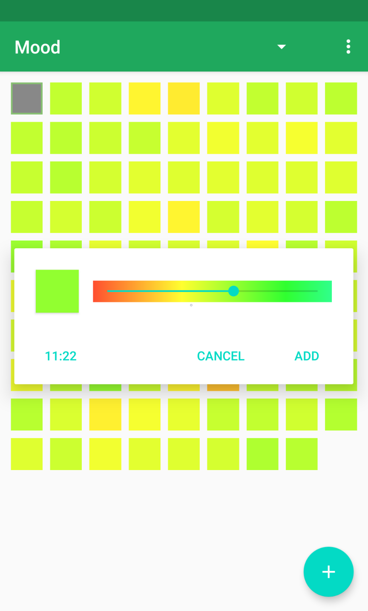

# Color Calendar

Simple color day tracking app for Android.

## About

Track your days in color. Written in **kotlin** for **Android**.  

Available on the **Google Play store**. 
<a href="https://play.google.com/store/apps/details?id=com.mare5x.colorcalendar">
	
</a>

## Build

 1. ```git clone https://github.com/mare5x/ColorCalendar.git```
 2. Import using Android Studio.
 3. Build and run.

## [Screenshots](./res/screenshots/)



