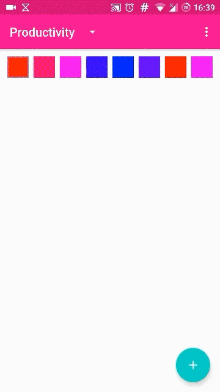

# Color Calendar

Simple color day tracking app for Android.

## About

Track your days in color. Written in **kotlin** for **Android**.

## Build

 1. ```git clone https://github.com/mare5x/ColorCalendar.git```
 2. Import using Android Studio.
 3. Build and run.

Release APK available in [Releases](https://github.com/mare5x/ColorCalendar/releases).

## Demo



